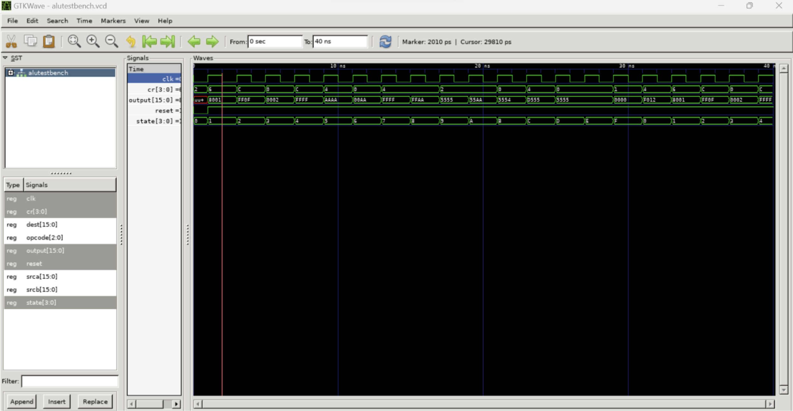
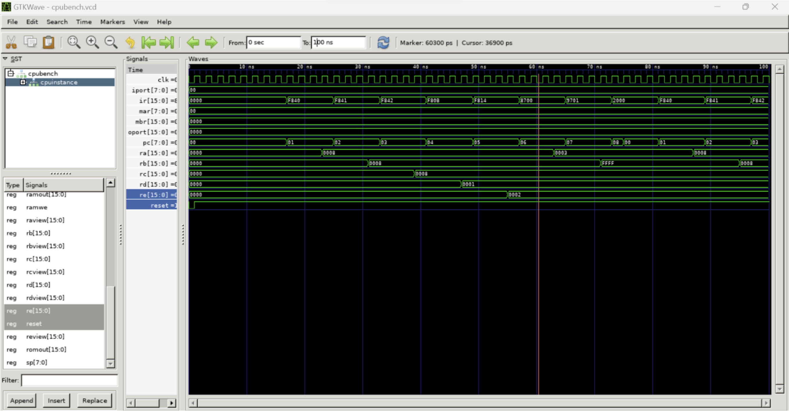
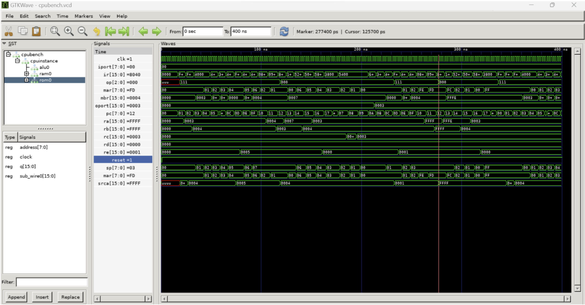
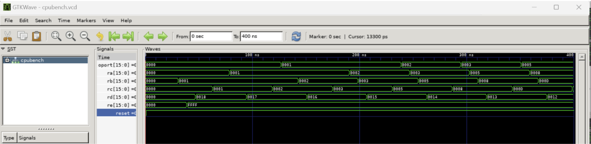

# RISC CPU Design (VHDL)

> 🚀 This project demonstrates a working RISC-style CPU designed in VHDL, including ROM, RAM, ALU, and a 9-state control Finite State Machine.
> Simulated with GHDL + GTKWave.

---

## 🧠 Architecture

A modular RISC CPU built with the following components:
- **Program ROM** (`ProgramROM.vhd`) — 256×16-bit instruction memory
- **Data RAM** (`DataRAM.vhd`) — 256×16-bit data memory
- **ALU** (`alu.vhd`) — Supports arithmetic, logic, and shift operations
- **Register File** — 6 general-purpose registers (RA–RE) + stack pointer
- **CPU Control** (`cpu.vhd`) — 9-state FSM manages the instruction lifecycle

---

## ⚙️ State Machine

1. **Start**: Initialization (8 cycles)
2. **Fetch**: Read instruction from ROM
3. **Execute-Setup**: Operand fetch & decode
4. **Execute-ALU**: ALU operation execution
5. **Execute-MemWait**: Handle memory latency
6. **Execute-Write**: Writeback phase
7. **Execute-Return-Pause**: Return instruction handling
8. **Halt**: Terminal state

---

## 🧾 Instruction Set Summary

| Category      | Instructions                                |
|---------------|---------------------------------------------|
| **Load/Store** | Direct, indexed memory access               |
| **Arithmetic** | `ADD`, `SUB` with overflow detection        |
| **Logic**      | `AND`, `OR`, `XOR`                          |
| **Shift**      | Logical and arithmetic shift, rotate        |
| **Branching**  | Conditional and unconditional branches      |
| **Stack**      | `PUSH`, `POP`, `CALL`, `RETURN`             |
| **I/O**        | Memory-mapped I/O operations                |

4-bit condition register supports Zero, Overflow, Negative, and Carry flags.

---

## 🧪 Simulation & Testing

All components were tested using GHDL and analyzed using GTKWave.

### ALU Verification
Demonstrates correct operation of arithmetic and logic functions.

> _Figure: GTKWave output for `alu.vhd` simulation_

### Full CPU Test: Basic Instruction Execution
Tested using a sample program to validate instruction decoding, memory access, and control flow.

> _Figure: GTKWave simulation using `program.mif`_

### Stack Operation Test: Function Calls
Tests nested function calls and return operations using the stack.

> _Figure: GTKWave simulation using `testcall.mif`_

### Full Program: Fibonacci Generator
End-to-end validation of ALU, control flow, and stack using the Fibonacci algorithm.

> _Figure: GTKWave simulation using `fibonacci.mif`_

